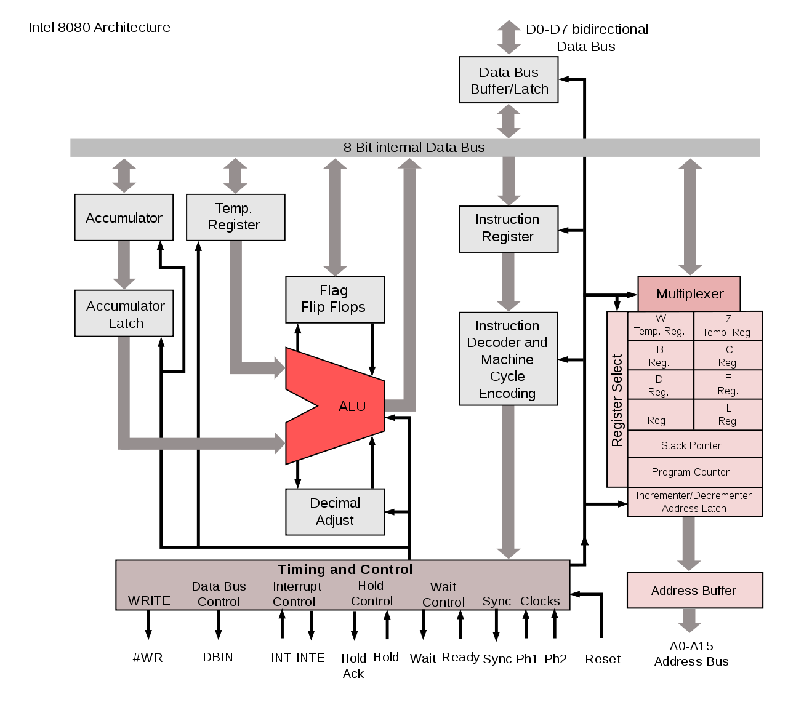

# Intel 8080 Simulator (SystemC)

[diagram source](https://en.wikipedia.org/wiki/Intel_8080)

## Implemented modules

* Arithmetic and Logic Unit (ALU)
* 64 kB memory
* Control Unit (partially)
* Multiplexer
* Register

## Implemented instruction set

* NOP
* HLT
* ALU (ADD, ADC, SUB, SBB, ANA, XRA, ORA, CMP)
* ALU Immediate (ADI, ADI, SUI, SBI, ANI, XRI, ORI, CMI)
* MVI
* ...

## Disclaimer

This is not intended to be a fully accurate or complete simulator of the Intel 8080.
It’s a personal hobby project, currently in the early stages of development.
The primary goal of this project is to honor the technology and gain a deeper understanding of microprocessor internals, as well as the SystemC.
